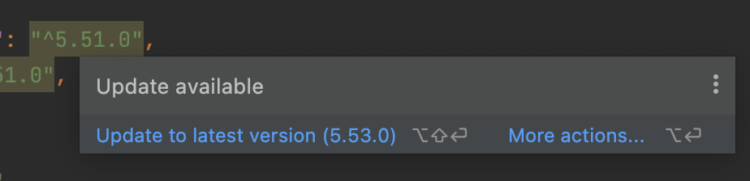
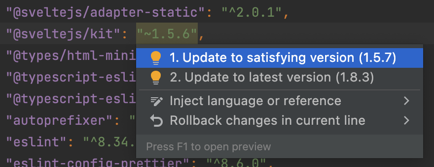
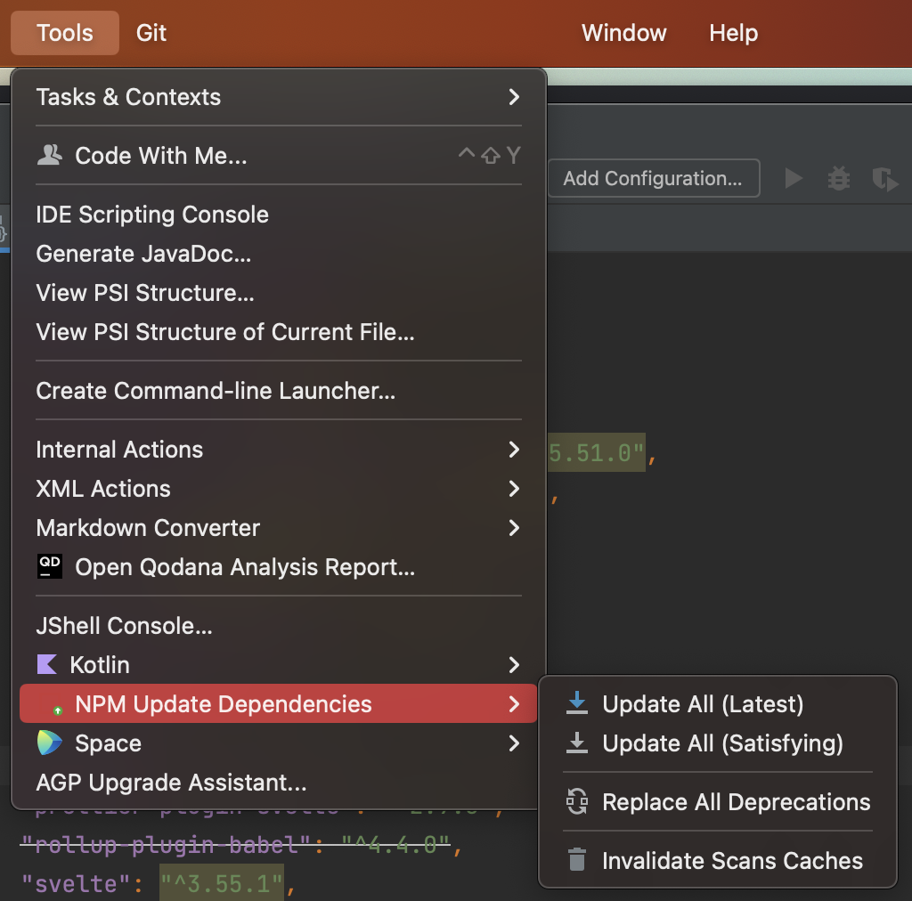
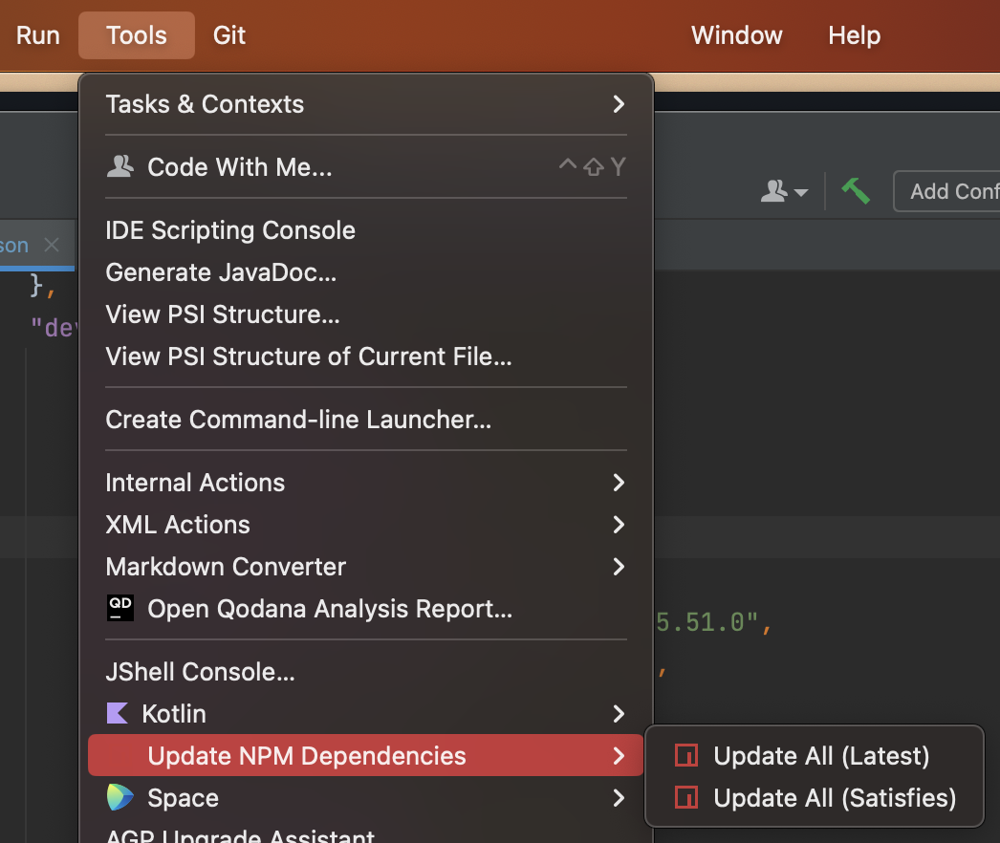

# npm-update-dependencies

## Upcoming features
- [ ] Add update check progress in status bar
- [ ] Keyboard shortcuts

## Description
<!-- Plugin description -->
Update your npm dependencies with a single click.

This plugin will update all the dependencies in your package.json file to the latest version, or the satisfying version depending on your choice.

## Usage

There are 3 ways to update your dependencies:
- Hover over the dependency and click the update button:
    
    
- Right click in the package.json file and select the extension from the context menu:
    
- Use the Tools menu:
    

> Works by fetching [registry.npmjs.org](https://registry.npmjs.org).  
> Rewrite of the existing [npm-dependency-checker](https://github.com/unger1984/npm-dependency-checker) plugin.
<!-- Plugin description end -->

## Installation

- Using IDE built-in plugin system:
  
  <kbd>Settings/Preferences</kbd> > <kbd>Plugins</kbd> > <kbd>Marketplace</kbd> > <kbd>Search for "npm-update-dependencies"</kbd> >
  <kbd>Install Plugin</kbd>
  
- Manually:

  Download the [latest release](https://github.com/WarningImHack3r/npm-update-dependencies/releases/latest) and install it manually using
  <kbd>Settings/Preferences</kbd> > <kbd>Plugins</kbd> > <kbd>⚙️</kbd> > <kbd>Install plugin from disk...</kbd>

---
Plugin based on the [IntelliJ Platform Plugin Template][template].

[template]: https://github.com/JetBrains/intellij-platform-plugin-template
